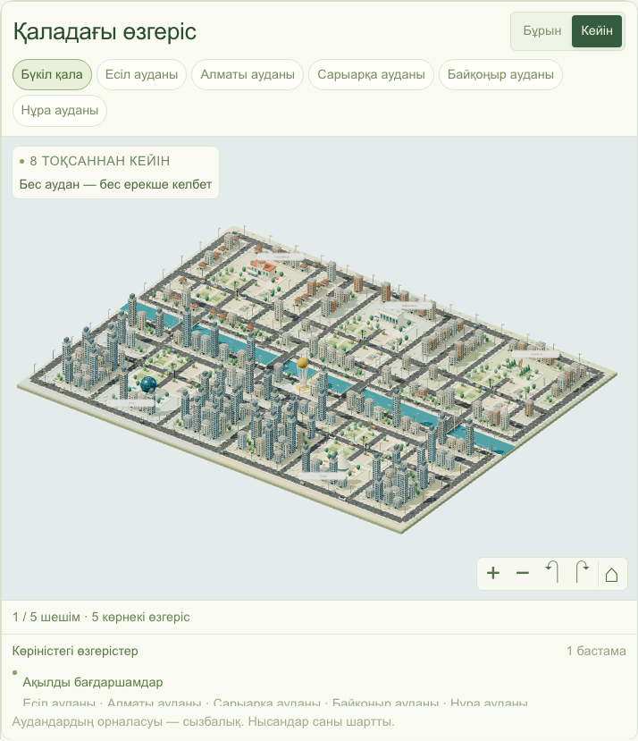

# 5 сағатқа әкім · Mayor for 5 Hours

A Kazakh-language city management simulator for Astana. Spend a **100-unit budget**, choose **five projects**, and see how your decisions change the city’s quality of life and its interactive 3D model. AI explains the calculated results in Kazakh.

**Hackathon prototype:** all district statistics, costs, and effects are synthetic. The city model is schematic, not a geographic map. “Five hours” is the game’s name; the simulation covers eight quarters and has no countdown timer.

> **Use the repository root.** The current project contains `app/`, `components/`, `lib/`, and `package.json` here. If your local checkout includes `hack-7859a9cd-aigaalac/` inside it, that is an ignored copy of the previous project; do not run or deploy that nested folder.

[Run locally](#run-locally) · [Deploy to Vercel](#deploy-to-vercel) · [Demo walkthrough](#demo-walkthrough) · [Tests](#tests)

## What you can do

- Explore five districts: Есіл, Алматы, Сарыарқа, Байқоңыр, and Нұра.
- Choose from 14 projects across transport, environment, social infrastructure, safety, and city services.
- Watch projects appear in the 3D city, focus on a district, and switch between before/after views.
- See budget, district metrics, implementation delays, and project synergies.
- Confirm a plan to receive a deterministic quality-of-life score and an AI explanation.
- Edit a plan and save scenarios A/B for comparison in the same browser.
- Use the simulator on desktop or mobile; district information remains available if WebGL is unavailable.



## Run locally

**Requirements:** Node.js **22.18 or later** and npm. Node.js 22 is a suitable choice for reproducing this project.

```bash
git clone https://github.com/BAITC-Hacks/hack-7859a9cd-aigaalac.git
cd hack-7859a9cd-aigaalac
npm ci
cp .env.example .env.local
npm run dev
```

Open **http://localhost:3000**. If you already have the project checked out, run the commands starting with `npm ci` from its root.

The interface, 3D city, scoring, and A/B comparison work **without an API key**. To enable AI explanations, edit `.env.local`:

```dotenv
OPENAI_API_KEY=your_openai_api_key_here
OPENAI_MODEL=gpt-4o-mini
```

| Variable | Required? | Purpose |
| --- | --- | --- |
| `OPENAI_API_KEY` | Only for AI explanations | Server-side API credential; the API account needs available quota. |
| `OPENAI_MODEL` | No | Defaults to `gpt-4o-mini`. This implementation also accepts `gpt-4o`. |

Restart the development server after changing environment variables. Keep `.env.local` private: it is ignored by Git. Never give the key a `NEXT_PUBLIC_` prefix or put it in browser code.

To run the production build locally:

```bash
npm run build
npm start
```

## Deploy to Vercel

This section is a deployment tutorial. No hosted deployment is required to run or review the repository locally.

The app requires a **Next.js server runtime** for `POST /api/analyze`; do not deploy it as a static HTML export. No database or separate backend service is needed.

### Option 1 — Vercel dashboard

1. Push the current project to a GitHub repository that your Vercel account can access.
2. Sign in at [Vercel](https://vercel.com/new), choose **Add New → Project**, and import the repository.
3. Configure the project:

   | Setting | Value |
   | --- | --- |
   | Framework preset | **Next.js** |
   | Root directory | Repository root (`./`); leave the default root selected |
   | Install command | `npm ci` |
   | Build command | `npm run build` |
   | Output directory | Leave the Next.js default; do not override it |
   | Node.js version | **22.x** |

4. Under **Environment Variables**, add `OPENAI_API_KEY` for **Production** if AI explanations are needed. Add it for **Preview** too if you want AI in preview deployments. Optionally add `OPENAI_MODEL=gpt-4o-mini`. Enter the values without surrounding quotes. These variables must be configured on Vercel; your local `.env.local` is not the hosted configuration.
5. Click **Deploy**. When the build finishes, open the URL Vercel provides.
6. Run the [demo walkthrough](#demo-walkthrough). Confirm the home page loads, project selection works, and submitting the reference plan returns **55.61**. With a working key, the result also includes a Kazakh AI explanation; without one, the score still works and the app reports that AI analysis is unavailable.

If the organization repository is missing from the import list, ask its owner to enable Vercel access, or use the CLI method below to deploy your local checkout to your own Vercel project.

After changing hosted environment variables, **redeploy** to apply them. A connected Git repository can trigger subsequent deployments when you push changes.

### Option 2 — Vercel CLI

Run these commands from the project root:

```bash
npx vercel@latest login
npx vercel@latest link
```

Choose your account/team, create or select a project, and use `./` as its source directory. Set the project’s Node.js version to **22.x** in Vercel’s project settings.

If you need AI explanations, add the key through the interactive prompt:

```bash
npx vercel@latest env add OPENAI_API_KEY production
```

Then deploy:

```bash
npx vercel@latest --prod
```

Open the production URL printed by the CLI and follow the demo walkthrough. Repeat the final command after local changes to publish a new version. Never commit `.env.local` or paste a real API key into the README.

Official reference: [Deploying with the Vercel CLI](https://vercel.com/docs/cli/deploy) and [Next.js on Vercel](https://vercel.com/docs/frameworks/full-stack/nextjs).

## Demo walkthrough

1. Open the app. The baseline city score is **52.56**, and the available budget is **100**.
2. Select the following projects and assign the specified districts:

   | ID | Project | District / scope | Cost |
   | --- | --- | --- | ---: |
   | M1 | Dedicated bus lanes | Нұра | 18 |
   | M5 | Cleaner fuel for private housing | Сарыарқа | 25 |
   | M7 | School and kindergarten | Нұра | 24 |
   | M10 | Street lighting and cameras | Нұра | 12 |
   | M12 | Unified resident requests platform | Whole city | 14 |

3. Check that total cost is **93**, with **7** remaining. Click **«Растау»** (Confirm).
4. The final score is **55.61**, an improvement of **+3.05**. Нұра’s district score changes from **49.18 → 53.13**. The number of critical metrics falls from **2 → 1**; Нұра’s healthcare metric remains **35**. The M10 + M12 synergy improves Нұра’s street safety.
5. Save the result in **A**, click **«Жоспарды өзгерту»** (Edit plan), move the school to another district, and confirm again. Save the new result in **B** to compare the plans.
6. Use the city’s before/after controls to inspect the project changes. **«Қайта бастау»** (Restart) clears the current choices; saved A/B plans have separate delete controls.

A/B plans are saved in the current browser, not in a shared account or server database. Saving or comparing them does not make an AI request.

## Current game rules and scoring

- Spend no more than **100** units; unspent budget gives no score bonus.
- Select **exactly five distinct projects: one from each of the five categories**.
- Assign one district to each district-level project. City-level projects affect all five districts and are paid for once.
- M1 and M3 cannot be combined. M4 + M7 and M5 + M13 cannot share a district.
- Invalid plans cannot be confirmed; the server independently validates all decisions before calling AI.

Each metric is on a 0–100 scale, where higher is better. Project effects are adjusted for implementation delays over an eight-quarter horizon. Fixed synergy bonuses are then included, and metrics are clamped to 0–100.

```text
realized project effect = full effect × (8 − delay in quarters) / 8

district score = weighted sum of the district's ten metrics
city average   = population-weighted average of district scores

final score = 0.7 × city average
            + 0.3 × lowest district score
            − number of district metrics strictly below 40
```

**AI explains the numbers; it does not calculate or change them.** If the provider fails or the key is missing, the API still returns the real simulation result with `analysis.status = "unavailable"`. An AI request times out after 35 seconds; retrying analysis is a user action.

See [scoring and dataset details](docs/scoring.md) and [3D city documentation](docs/city-3d.md).

## Project structure

The stack is **Next.js 14 App Router, React 18, TypeScript, Tailwind CSS, and Three.js**. District and project data live in local JSON files.

```text
app/page.tsx              Loads the catalog and renders the simulator
app/api/analyze/route.ts   POST endpoint: validation, scoring, AI explanation
components/               Simulator, 3D city, district views, A/B comparison
lib/score.ts              Deterministic game rules and score calculations
lib/analyze.ts            Coordinates scoring and optional AI analysis
lib/openai.ts             Server-side AI request and response validation
lib/data.ts               Local JSON data adapter
lib/city-*.ts              City geometry, layout, landmarks, and visual state
data/                     District metrics and the 14-project catalog
tests/                    Unit tests and desktop/mobile Playwright tests
docs/                     Scoring reference, 3D documentation, screenshots
```

## API

Send project IDs and district IDs only. Costs, effects, and scores are read or calculated on the server.

```bash
curl -X POST http://localhost:3000/api/analyze \
  -H 'Content-Type: application/json' \
  -d '{"decisions":[{"actionId":"M1","districtId":"nura"},{"actionId":"M5","districtId":"saryarka"},{"actionId":"M7","districtId":"nura"},{"actionId":"M10","districtId":"nura"},{"actionId":"M12"}]}'
```

Omit `districtId` for city-level projects. District IDs are `esil`, `almaty`, `saryarka`, and `baikonur`, plus `nura`.

| Status | Meaning |
| --- | --- |
| `200` | `{ result, analysis }`; AI status is `complete` or `unavailable`. |
| `400` | Invalid JSON, unexpected fields, or an invalid plan. No AI call is made. |
| `413` | Request body exceeds 4,096 characters. |
| `500` | Server-side data loading or simulation failure. |

## Tests

```bash
npm test                 # Unit tests for rules, scoring, AI handling, and city logic
npm run typecheck        # TypeScript checks
npm run build            # Production build and Next.js validation
```

For desktop and mobile browser tests:

```bash
npx playwright install chromium
npm run build
npm run test:e2e
```

Playwright starts its own production server at `127.0.0.1:3010`; keep that port free. The test server uses an empty API key, so it makes no paid AI requests. Browser-test artifacts are written to `test-results/`.

## Troubleshooting and limitations

| Problem | What to check |
| --- | --- |
| AI analysis unavailable | Check `OPENAI_API_KEY`, API quota, and the allowed `OPENAI_MODEL` values. Restart locally or redeploy after changing variables. The score remains usable. |
| Vercel builds the wrong app | Select the repository root, not the nested copy of the previous project. |
| Production server will not start locally | Run `npm run build` before `npm start`. |
| Port 3000 is busy | Run `npm run dev -- --port 3002` and open `http://localhost:3002`. |
| 3D city does not render | Enable browser hardware acceleration/WebGL, or use the district information and results without 3D. |
| Saved A/B plans disappeared | They belong to the browser and origin where they were saved. Clearing browser storage removes them. |

This prototype has no accounts, shared leaderboard, server-side saved sessions, random city events, or presentation export. It retains Next.js 14 from the hackathon implementation. Before a long-term public deployment, review `npm audit`, upgrade to a supported patched Next.js version, and rerun the checks; a hosting platform may reject a dependency version with known vulnerabilities. The AI endpoint currently has no authentication or application-level rate limiting.
