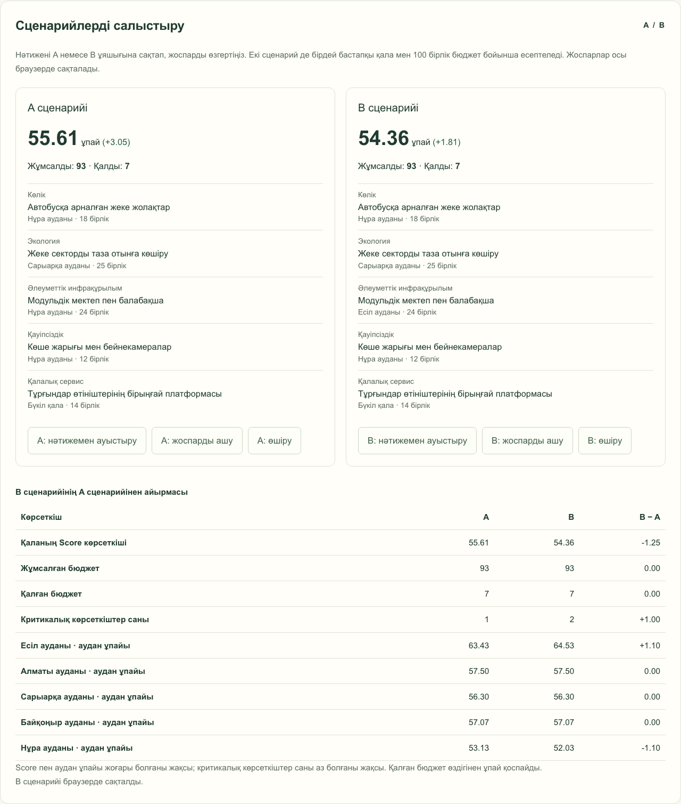

# 5 сағатқа әкім

**Астананы басқарудың қазақша AI-симуляторы.** Пайдаланушы **100 шартты бірлік** бюджетті пайдаланып, 14 іс-шараның ішінен дәл **5 шешім** қабылдайды. Бағыттар: көлік, экология, әлеуметтік сала, қауіпсіздік және қалалық сервис. Аудандық жобаға бір аудан тағайындалады, қалалық жоба бес ауданға да әсер етеді. Сервер іске қосылу кідірісін, жобалардың бірлескен әсерін, халық үлесін және әлсіз аудандардың жағдайын ескеріп, **Astana Quality of Life Score** есептейді. OpenAI есептелген нәтижені қазақша түсіндіреді.

Деректер — хакатонға арналған синтетикалық модель. Есіл, Алматы, Сарыарқа, Байқоңыр және Нұра аудандарының берілген көрсеткіштері, халық үлестері, құндар мен әсерлер ресми статистика емес. «5 сағат» — ойынның атауы; кері санақ таймері жоқ. Симуляция көкжиегі — **8 тоқсан**, яғни 2 шартты жыл.

Қаланың интерактивті **3D макетінде** әр таңдау көрінеді: мектеп, саябақ, көлік желісі немесе сервис нысаны тиісті ауданға қосылады. Ауданды бөлек қарап, бастапқы күй мен таңдаулардан кейінгі көріністі салыстыруға болады. Макет сызбалық, нақты географиялық карта емес. Толық сипаттама: [docs/city-3d.md](docs/city-3d.md).

Әр ауданның тұрақты сәулеттік белгісі бар: **Есіл — EXPO «Нұр Әлем» сферасы, Нұра — «Хан Шатыр», Сарыарқа — «Астана-1» вокзалы, Байқоңыр — «Жастар» сарайы, Алматы — «Жерұйық» саябағы**. Ғимараттардың пішіні, орамдардың түсі және алаңдары аудандарды ажыратуға көмектеседі. Бұл белгілер бастапқы қаланың бөлігі: бюджет жұмсамайды, бес шешім қатарына кірмейді және score-ға әсер етпейді. Жоба қосылса не алынса да сақталады. Ауданға сәйкестігін растайтын сілтемелер [3D құжаттамасындағы кестеде](docs/city-3d.md#аудандардың-тұрақты-сәулеттік-белгілері) берілген.

Таңдау кезінде қала мен бюджет экранда бірге қалады: компьютерде бастама карточкалары сол жақта, 3D көрініс оң жақта; телефонда ықшам қала панелі карточкалардың үстінде бекітіледі. Жобаларды төмен қарай қарап, аудан таңдағанда өзгеріс сол көріністе бірден жаңарады. Аудандардың толық метрикалары таңдау бөлімінен кейін берілген.

## Интерфейс




[Телефондағы салыстыру көрінісі](docs/screenshots/comparison-mobile.png)

## Стек

- Next.js **14.2.35**, App Router, React 18, TypeScript.
- Tailwind CSS 3 және бейімделетін CSS; сыртқы шрифттер мен сурет сервистері қажет емес.
- Three.js: браузердегі 3D қала, бағдарламамен жасалған нысандар және камераны басқару.
- Локалды JSON деректері және бөлек `SimulationRepository` интерфейсі.
- OpenAI Chat Completions API, `gpt-4o-mini` (әдепкі) немесе `gpt-4o`.
- Node test runner + tsx; Playwright браузерлік тесттері.

## Іске қосу

Талаптар: **Node.js 22.18+**, npm. Тәуелділіктерді орнатуға және OpenAI талдауына интернет керек. Деректер қоры қажет емес.

Жоба түбірінде:

```bash
npm install
cp .env.example .env.local
```

`.env.local` файлын редакторда ашып, өз кілтіңізді қойыңыз:

```dotenv
OPENAI_API_KEY=your_openai_api_key_here
OPENAI_MODEL=gpt-4o-mini
```

Кілт тек серверде оқылады. Оған `NEXT_PUBLIC_` префиксін қоспаңыз. `.env.local` Git-ке қосылмайды. `.env.example` ішінде құпия кілт жоқ. `OPENAI_MODEL` міндетті емес; рұқсат етілген мәндер — `gpt-4o-mini`, `gpt-4o`.

```bash
npm run dev
```

Браузерде **http://localhost:3000** ашыңыз. `.env.local` өзгертілгеннен кейін dev серверін қайта іске қосыңыз.

Өндірістік жинақты жергілікті тексеру:

```bash
npm run build
npm start
```

Қайта орнатуда lockfile-дағы дәл нұсқалар қажет болса, `npm ci` қолданыңыз.

**API кілтінсіз де интерфейс пен есептеу жұмыс істейді.** Нәтиже экранында шынайы есептелген score және AI талдауы қолжетімсіз екені көрсетіледі. Жасанды AI мәтіні берілмейді. Кілт жарамды және API аккаунтының квотасы жеткілікті болса, «AI талдауын қайталау» талдауды қайта сұратады. Бір OpenAI сұрауының тайм-ауты — 35 секунд; автоматты ақылы retry жоқ.

## Ойын ережелері

- Бюджет барлық пайдаланушыға бірдей: **100 шартты бірлік**. Бұл теңге емес; қалдық жоғалмайды және қосымша score бермейді.
- Дәл **5 түрлі іс-шара** таңдалады. Бір іс-шараны басқа ауданға қайта таңдап қосуға болмайды.
- Бес бағыттың **әрқайсысынан дәл бір іс-шара** міндетті. Бір бағыттағы екінші бастаманы таңдау үшін бұрынғысын алып тастаңыз.
- Бюджет жетпейтін бастаманың таңдауы бұғатталады және жетпейтін сома көрсетіледі. Сервер бюджет пен барлық бес бағытты тәуелсіз тексереді.
- «Аудан» түріндегі іс-шара үшін бір аудан міндетті. «Қала» түріндегі іс-шара үшін аудан таңдалмайды; әсер барлық бес ауданға қолданылады, құны бір рет төленеді.
- **M1 + M3** бірге таңдалмайды, аудандары әртүрлі болса да. **M4 + M7** және **M5 + M13** жұптары бір ауданда бірге іске асырылмайды.
- Бюджет, сан, аудан, бағыт лимиті немесе үйлесімділік ережесі бұзылса, растау мүмкін емес. Сервер де сұрауды қабылдамайды және AI шақырмайды.

## Судьяларға арналған тексеру сценарийі

1. Бастапқы score — **52.56**, бюджет — **100**. Бес ауданның профилін, халық үлесін және он метрикасын қараңыз. Нұрада 40-тан төмен екі бастапқы көрсеткіш бар: **S1 = 38**, **S2 = 35**.
2. Төмендегі бес жобаны белгілеңіз. Аудандық жобаларға көрсетілген ауданды тағайындаңыз.

| Іс-шара | Аумақ | Құны |
| --- | --- | ---: |
| M7 — Мектеп пен балабақша | Нұра | 24 |
| M1 — Автобустарға арналған арнайы жолақтар | Нұра | 18 |
| M10 — Жарықтандыру және камералар | Нұра | 12 |
| M12 — Өтініштердің бірыңғай цифрлық платформасы | Бүкіл қала | 14 |
| M5 — Жеке секторды таза отынға көшіру | Сарыарқа | 25 |

3. Жалпы құн **93**, қалдық **7** болады. «Растау» басылғаннан кейін score **55.61**, өсім **+3.05** шығады. Нұраның аудандық бағасы **49.18 → 53.13**, критикалық көрсеткіштер саны **2 → 1**. **M10 + M12** бірлескен бонусы Нұраның B1 көрсеткішіне қосылады.
4. Аудандық нәтижелерден Нұраның **S1 = 48**, **S2 = 43.75**, **B1 = 67.50** мәндерін тексеріңіз. Қаладағы халық үлесімен өлшенген орташа аудан бағасы **56.8624 → 58.0776** болады.
5. Бюджет бақылауын тексеру үшін M12 орнына M13-ті таңдап, оған Алматы ауданын тағайындаңыз. Құн **109**, жетпейтін сома **9** болады; растауға болмайды. Төрт шешіммен де растауға болмайды.
6. Жарамды жоспарға оралып, AI талдауындағы күшті жақтарды, тәуекелдер мен ымыраларды және 1–2 ұсынысты қараңыз. «Қайта бастау» таңдауларды тазалайды.

Таңдаулар белгі қою арқылы қосылады және алынады. Клиент шығынды, аудандық әсерді, кідіріс пен бірлескен әсерді көрсетеді. Алдын ала көрініс AI шақырмайды және жарамсыз жоспарға қорытынды score бермейді.

3D көріністі тексеру: M7-ні Нұраға тағайындағанда оқу кешені пайда болады; ауданды Есілге ауыстырғанда нысан да ауысады. M12 қалалық сервис нүктесін бес ауданға қосады. Таңдау панеліндегі «Бұрын» жаңа нысандарды жасырады, «Кейін» оларды қайта көрсетеді; шешімдер мен бюджет сақталады. Жаңа бастама не аудан таңдалғанда панель жаңартылған «Кейін» көрінісіне ауысады. Телефондағы «Нысандар» батырмасы нысандар тізімін ашады. Камераның жақындату, алыстату, бұру және бастапқы орынға қайтару батырмаларын тексеріңіз. WebGL ашылмаса, мәтіндік аудан карточкалары мен есептелген нәтижелер қолжетімді болып қалады.

Бес ауданның батырмаларын кезекпен басқанда камера тиісті ауданға ауысып, оның сәулеттік белгісінің атауы көрсетіледі. M7-ні Нұраға қосып, «Бұрын»/«Кейін» көріністерін ауыстырыңыз: мектептің көрінуі өзгереді, ал «Хан Шатыр» мен қалған төрт ауданның белгілері сақталады. Мектепті алып тастау да оларды жоймайды.

## Жоспарды өңдеу және A/B салыстыру

1. Бес бағыттан бір-бір жоба таңдап, нәтижені растаңыз.
2. «A: нәтижені сақтау» батырмасын басыңыз.
3. «Жоспарды өзгерту» таңдаулар мен аудандарды сақтап, өңдеу экранына қайтарады. Мысалы, M7 мектебін Нұрадан Есілге ауыстырыңыз.
4. Қайта растаңыз да, «B: нәтижені сақтау» батырмасын басыңыз. Кестеде Score, шығын, қалдық, критикалық көрсеткіштер саны және бес ауданның ұпайы салыстырылады.
5. «A: жоспарды ашу» сақталған таңдауларды өңдеуге қайтарады. Толған ұяшықтағы «нәтижемен ауыстыру» сол ұяшықты ағымдағы нәтижемен ауыстырады. «Қайта бастау» ағымдағы таңдауды тазартады; A/B жоспарлары бөлек «өшіру» батырмасымен жойылады.

Браузерде тек іс-шара мен аудан идентификаторлары сақталады. Бетті қайта ашқанда олар қазіргі каталогпен тексеріліп, бірдей бастапқы деректерден қайта есептеледі. Ескірген немесе жарамсыз жоспар қабылданбайды. Сақтау мен салыстыру AI сұрауын жасамайды; ашылған жоспарды растау жаңа AI талдауын сұратады. Браузер жады қолжетімсіз болса, салыстыру бет жабылғанға дейін жұмыс істейді және ескерту көрсетіледі.

## Score формуласы

Он метриканың бәрі 0–100 аралығында: **жоғары болғаны жақсы**. Мысалы, T1 — жолдардың кептелістен бос болуы, E2 — ауаның тазалығы. Толық анықтамалар, салмақтар, каталог және бастапқы деректер: [docs/scoring.md](docs/scoring.md).

```text
H = 8 тоқсан
realizedEffect = fullEffect × (H − lag) / H
final[d][k] = clamp(initial[d][k] + sum(applicableRealizedEffects) + synergy[d][k], 0, 100)
D[d] = sum(metricWeight[k] × final[d][k])
D_avg = sum(populationShare[d] × D[d])
N_crit = count(final[d][k] < 40)
Astana Quality of Life Score = 0.7 × D_avg + 0.3 × min(D[d]) − N_crit
```

Салмақтардың 70%-ы қала бойынша нәтижеге, 30%-ы ең әлсіз ауданға тиесілі. Әрбір «аудан × метрика» жұбының соңғы мәні **қатаң түрде 40-тан төмен** болса, 1 ұпай шегеріледі; 40-тың өзі критикалық емес. Аудандық жобалар тек таңдалған ауданға, қалалық жобалар барлық ауданға әсер етеді. Бірлескен бонус кідіріске көбейтілмейді. Әсерлер мен бонустар алдымен қосылып, 0–100 шектеуі соңында бір рет қолданылады; шешімдердің реті нәтижені өзгертпейді.

Аралық есептер дөңгелектелмейді, экрандағы score екі ондық таңбамен беріледі. Бастапқы дәл нәтиже — **52.55768**, мысал жоспардың нәтижесі — **55.61002**. Мысал бес бағыттың әрқайсысынан бір жобаны қамтиды. Қалалық Score «ұпай» ретінде көрсетіледі: критикалық көрсеткіштер үшін айып болғандықтан, жалпы формула теориялық түрде теріс нәтиже бере алады. Жеке метрикалар мен аудан бағалары 0–100 аралығында қалады. Әртүрлі жоспарлар бірдей score бере алады: жасанды бірегейлік бонусы қосылмайды.

## Архитектура

```text
app/page.tsx                     Сервер компоненті: деректерді жүктеу
components/simulator.tsx         Жобалар, аудан тағайындау, бюджет және нәтиже
components/scenario-comparison.tsx A/B сақтау, қалпына келтіру және салыстыру
components/simulator-workspace.module.css Таңдаулар жанындағы бекітілген қала панелі
components/district-explorer.tsx Бес аудан, он метрика және өзгерістер
components/city-view.tsx         3D көрініс басқаруы және мәтіндік баламасы
components/city-scene.tsx        Three.js камерасы және интерактивті рендер
app/api/analyze/route.ts         POST: сұрауды тексеру және талдау
lib/types.ts                    Домен типтері және репозиторий интерфейсі
lib/data.ts                     Локалды JSON репозиторийі (сервер)
lib/score.ts                    Таза есептеу, кідіріс, бонустар және валидация
lib/districts.ts                UI мен AI үшін аудандық есеп
lib/city-visuals.ts             Шешімдер мен метрикаларды 3D күйіне түрлендіру
lib/city-geometry.ts            Қала мен 14 жоба түрінің геометриясы
lib/district-identities.ts      Аудандардың сәулеттік белгілері мен түстері
lib/city-landmarks.ts           Бес тұрақты сәулеттік макеттің геометриясы
lib/analyze.ts                  Валидация → score → AI түсіндірме
lib/openai.ts                   OpenAI сұрауы және жауап құрылымын тексеру
data/districts.json             Бес аудан, халық үлестері және он метрика
data/actions.json               Аумақ түрі мен кідірісі бар 14 іс-шара
tests/score.test.ts             Формула, ережелер, аудандық және қалалық әсер
tests/analyze.test.ts           AI шақыру тәртібі және қателері
tests/city-visuals.test.ts       3D нысандарының аумағы, өзгеруі және дерек тұтастығы
tests/e2e/simulator.spec.ts      Компьютер/телефон сценарийлері және HTTP API
tests/e2e/city-3d.spec.ts        WebGL көрінісі, камера, нысандар және мәтіндік балама
tests/e2e/live-workspace.spec.ts Таңдау кезінде 3D көріністің экранда қалуы
tests/e2e/district-identities.spec.ts Бес ауданның белгілері және олардың сақталуы
```

Клиент ережелерді алдын ала тексереді. Сервер тек іс-шара ID-і мен тиісті аудан ID-ін қабылдап, каталогтан құн, әсер, аумақ түрі және кідірісті өзі оқиды. Клиенттен жіберілген `budget`, `cost`, `impact` немесе `score` сенімді дерек ретінде қабылданбайды. Таза есептеу функцияларына AI, желі не файл оқу қажет емес.

Толық емес таңдауда тек аудандық көрсеткіштердің болжамы мен бірлескен бонустар көрсетіледі; қорытынды қалалық Score есептелмейді. Ол бес шешімнің бәрі жарамды болғанда ғана шығады. Бастапқы Score бөлек анықтамалық мән ретінде сақталады. Алдын ала көрініс AI шақырмайды.

3D қабат сол есептелген метрикалар мен таңдалған іс-шараларды пайдаланады. Аудандық нысан тек өз ауданына, қалалық нысан барлық ауданға қосылады. Көрініс аудандық әсерлерді не score-ды қайта есептемейді және AI шақырмайды. Қате немесе аудан тағайындалмаған жоспар үшін бастапқы қала көрсетіледі. Three.js рендері тек клиентте жүктеледі; серверлік score оған тәуелсіз.

OpenAI **тек жарамды жоспар расталып, сервер есебі аяқталғаннан кейін** шақырылады. Ол таңдалған шешімдерді, құнды, іске асқан әсерді, бірлескен бонустарды, аудандық өзгерістерді, әр шараның үлесін және score құрамдастарын алады. AI осы сандарды түсіндіреді, күшті жақтар мен ықтимал салдарды атап, 1–2 ұсыныс береді; сандарды есептемейді және өзгертпейді. Жауап `strengths`, `tradeoffs`, `recommendations` массивтері бар JSON ретінде алынып, қазақша тармақтармен көрсетіледі. Модель жауабы HTML ретінде орындалмайды. Құрылымды жауаптың негізі: [OpenAI Structured Outputs](https://developers.openai.com/api/docs/guides/structured-outputs).

PostgreSQL-ге көшу үшін `SimulationRepository.getDistricts()` және `.getActions()` әдістерін жаңа адаптерде іске асырып, сервердегі адаптерді ауыстырыңыз. Домен типтері мен score функциялары өзгермейді. Бұл нұсқада серверлік ойын сессиялары сақталмайды; A/B жоспарлары пайдаланушының браузерінде сақталады.

## API

```http
POST /api/analyze
Content-Type: application/json
```

```json
{
  "decisions": [
    { "actionId": "M7", "districtId": "nura" },
    { "actionId": "M1", "districtId": "nura" },
    { "actionId": "M10", "districtId": "nura" },
    { "actionId": "M12" },
    { "actionId": "M5", "districtId": "saryarka" }
  ]
}
```

Қалалық іс-шарада `districtId` өрісі мүлде берілмейді. Аудандық іс-шарада ол міндетті.

- `200`: `{ result, analysis }`; `result` — сервер есептеген нәтиже. `analysis.status` — `complete` немесе `unavailable`.
- `400`: қате JSON/өрістер, белгісіз не қайталанған іс-шара, қате аудан, бес шешім талабының бұзылуы, бағыт лимиті, үйлесімсіздік немесе бюджет асуы. AI шақырылмайды.
- `413`: 4096 таңбадан үлкен сұрау.
- `500`: сервердің каталог деректерін оқу/есептеу қатесі.

## Тесттер

```bash
npm test
npm run typecheck
npm run build
```

Браузерлік тесттерге Chromium орнатыңыз, содан кейін өндірістік жинақты жасаңыз:

```bash
npx playwright install chromium
npm run build
npm run test:e2e
```

Егер Google Chrome орнатылған болса, Chromium жүктемей-ақ:

```bash
PLAYWRIGHT_CHANNEL=chrome npm run test:e2e
```

Playwright `127.0.0.1:3010` портында уақытша сервер ашады. Бұл порт бос болуы керек. Тест серверінде API кілті бос болады; ақылы сұраулар жасалмайды. AI сәтті жауабы жасанды жауаппен тексеріледі. Компьютер және телефон көріністерінің скриншоттары `test-results/` ішінде жасалады.

## Нұсқа шектеуі

Техтапсырмаға сай Next.js 14 сақталған. `npm audit` осы ескі major-нұсқаға қатысты upstream осалдықтар көрсетеді; 14.2.35 оларды түгел жаппайды. Бұл нұсқа жергілікті хакатон көрсетіліміне арналған. Ашық production орналастыру алдында қолдауы бар, түзетілген Next.js нұсқасына көшу қажет. PostCSS override-ы бөлек транзитивтік тәуелділікті жаңартады; ол Next.js осалдықтарын түзетпейді.

Бір браузерде A/B сценарийлерін салыстыру бар. Ортақ серверлік команда рейтингі, күтпеген қалалық оқиғаларды модельдеу және презентация генерациясы бұл кезеңге кірмейді.
